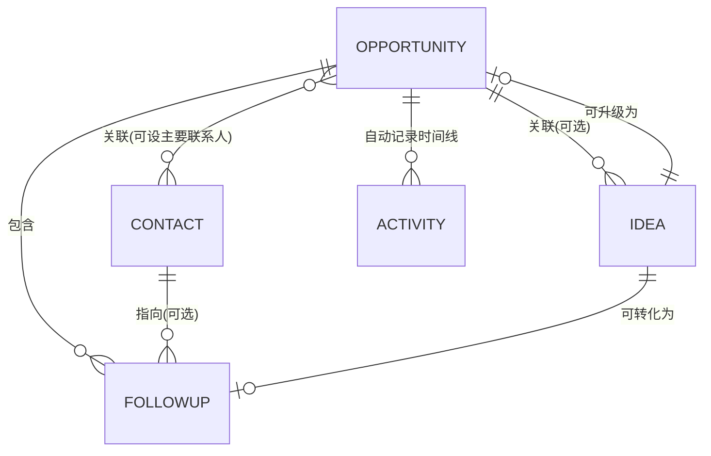
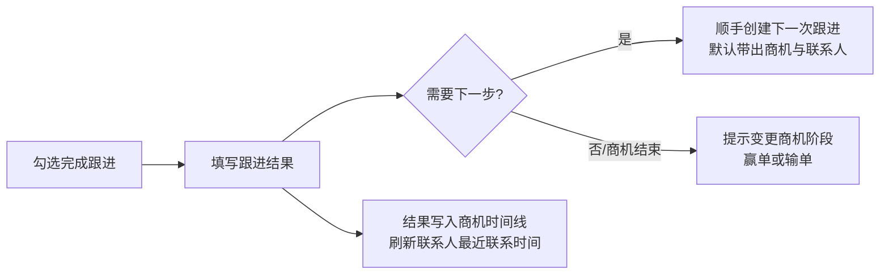

# 商机管理系统 · 产品设计方案(v0.1)

> 项目代号:**机汇 OpportunityManage** —— 让商机、联系人、跟进、想法在一处有序汇聚。
> 本文档是第一版设计思路,配套高保真 UI 原型见 [`prototype/index.html`](../prototype/index.html)。

---

## 1. 产品定位

**一句话定位:** 面向个人销售 / 小型销售团队的轻量商机管理工具(CRM-Lite),以"商机"为中心,把联系人、跟进事项、想法灵感有序地组织起来,保证每个商机永远有"下一步"。

**目标用户:**

- 独立销售、创业者、自由职业者:手里同时跟 5–30 个商机,靠微信备忘录和 Excel 管理,经常漏跟进;
- 3–10 人的小销售团队:不需要重型 CRM(权限、审批、BI),只要把过程管起来。

**核心设计原则:**

1. **商机为中心** —— 一切信息(联系人、跟进、想法、动态)都能挂到商机上,打开一个商机就能看到全貌;
2. **永远有下一步** —— 完成一次跟进时引导创建下一次跟进,避免商机"晾着";
3. **优先级贯穿全局** —— 商机、跟进、想法共用一套 P0–P3 优先级,任何列表都可按优先级排序过滤;
4. **录入要快** —— 全局"快速新建"入口,30 秒内记完一条信息,想法可以先记再整理。

---

## 2. 核心对象与关系

四个核心对象:**商机(Opportunity)、联系人(Contact)、跟进项(FollowUp)、想法(Idea)**。



- 商机 ↔ 联系人是多对多:一个商机可有多位联系人(并标记一位"主要联系人"),一位联系人也可能出现在多个商机里;
- 跟进项必须尽量挂在商机上(也允许独立存在,如"约新客户初次拜访");
- 想法可以独立存在,也可关联商机;想法支持**一键转化**:转为跟进项,或升级为商机;
- 商机的关键操作(阶段变更、完成跟进、新增想法/联系人)自动写入**时间线(Activity)**,形成过程档案。

---

## 3. 数据模型设计

### 3.1 商机 Opportunity

| 字段 | 类型 | 说明 |
| --- | --- | --- |
| id / createdAt / updatedAt | — | 基础字段 |
| name | string | 商机名称,如"ERP 系统升级项目" |
| company | string | 客户公司 |
| amount | number | 预计金额(分存储,展示为 ¥xx万) |
| stage | enum | 线索 → 初步接触 → 需求确认 → 方案报价 → 谈判 → 赢单 / 输单(可自定义) |
| priority | enum | P0 / P1 / P2 / P3 |
| winRate | number | 赢率 0–100%,可随阶段给默认值 |
| expectedCloseDate | date | 预计成交日期 |
| owner | user | 负责人(单机版默认自己) |
| source | enum | 来源:老客户转介绍 / 主动开拓 / 线上咨询 / 展会 / 其他 |
| tags | string[] | 标签,如「ERP」「华东区」 |
| contacts | ref[] | 关联联系人,含 isPrimary 标记 |
| lostReason | string? | 输单原因(仅输单时填写) |

### 3.2 联系人 Contact

| 字段 | 类型 | 说明 |
| --- | --- | --- |
| name | string | 姓名 |
| company / title | string | 公司、职位 |
| role | enum | 决策者 / 影响者 / 使用者 / 把关者 |
| phone / wechat / email | string | 联系方式 |
| notes | text | 备注(喜好、背景) |
| lastContactAt | date | 最近联系时间(由完成的跟进自动更新) |

### 3.3 跟进项 FollowUp

| 字段 | 类型 | 说明 |
| --- | --- | --- |
| title | string | 事项标题 |
| type | enum | 电话 / 拜访 / 邮件 / 微信 / 会议 / 其他 |
| opportunityId | ref? | 关联商机(推荐必填) |
| contactId | ref? | 关联联系人 |
| dueAt | datetime | 截止/计划时间,支持提醒 |
| priority | enum | P0 / P1 / P2 / P3 |
| status | enum | 待办 / 已完成 / 已取消 |
| result | text? | 完成时填写的跟进结果,写入商机时间线 |

### 3.4 想法 Idea

| 字段 | 类型 | 说明 |
| --- | --- | --- |
| title | string | 想法标题 |
| content | text | 内容(Markdown) |
| opportunityId | ref? | 关联商机(可空) |
| priority | enum | P0 / P1 / P2 / P3 |
| status | enum | 待评估 / 已采纳 / 已搁置 |
| tags | string[] | 标签 |
| convertedTo | ref? | 转化记录(跟进项 / 商机),转化后保留原想法并标记 |

---

## 4. 统一优先级体系

四级优先级,全局统一(商机 / 跟进项 / 想法共用),颜色在所有页面保持一致:

| 级别 | 含义 | 颜色 | 使用建议 |
| --- | --- | --- | --- |
| **P0 紧急** | 紧急且重要,今天必须推进 | 红 `#C43D2B` | 数量应极少(≤3) |
| **P1 重要** | 重要,本周要有动作 | 橙 `#C2690E` | 主力关注区 |
| **P2 普通** | 正常节奏推进 | 蓝 `#2F6FBF` | 默认级别 |
| **P3 观察** | 低优先级 / 长期观察 | 灰 `#6E7D76` | 定期批量回顾 |

规则:

- 所有列表、看板默认**按优先级 + 截止时间**排序,可切换;
- 工作台单独聚合「高优先级商机(P0/P1)」和「今日 / 逾期跟进」;
- 逾期是状态不是优先级:任何优先级的跟进逾期后都以红色醒目提示。

---

## 5. 信息架构与页面结构

```
机汇 OpportunityManage
├── 工作台 Dashboard         —— 今日总览与入口
├── 商机 Opportunities       —— 看板视图 / 列表视图 + 商机详情
├── 联系人 Contacts          —— 列表 + 详情
├── 跟进项 FollowUps         —— 按时间分组的全局任务清单
├── 想法 Ideas               —— 卡片墙 + 快速记录
└── 设置 Settings            —— 自定义阶段 / 标签 / 提醒规则(V1)
```

**整体布局:** 左侧深绿固定导航(带各模块数量角标)+ 顶部全局搜索与「快速新建」按钮 + 内容区。

### 5.1 工作台(Dashboard)

打开产品的第一屏,回答三个问题:**今天该做什么?哪些商机最要紧?最近发生了什么?**

- 指标卡 ×4:进行中商机数、在途总金额、本周待跟进(含逾期)、本季赢单率;
- 商机漏斗:按阶段展示数量与金额,色带由浅到深表示离成交越来越近;
- 今日跟进:逾期置顶标红,可直接勾选完成;
- 高优先级商机:P0/P1 商机速览(阶段、金额、赢率);
- 最近动态:全局时间线(阶段变更、跟进完成、新想法……)。

### 5.2 商机

- **看板视图(默认):** 按阶段分列,卡片显示客户、名称、金额、赢率、优先级、下次跟进时间;拖拽卡片即变更阶段并自动记录时间线;每列头部显示该阶段的单数与金额小计;
- **列表视图:** 表格展示全部字段,支持按任意列排序、按阶段/优先级/负责人过滤;
- **商机详情:** 顶部为阶段步进条(可点击推进)+ 关键信息(金额、赢率、预计成交、来源、标签);正文左栏为「待办跟进 + 跟进时间线」,右栏为「联系人 + 关联想法」。赢单/输单为显式操作,输单需填原因。

### 5.3 联系人

- 列表:姓名、公司/职位、角色(决策者/影响者/使用者/把关者)、联系方式、关联商机、最近联系时间;
- 详情:基本信息 + 参与的商机 + 与其相关的跟进记录;
- 「最近联系时间」由完成的跟进自动刷新,便于发现"太久没联系"的关键人。

### 5.4 跟进项

- 全局清单,按时间分组:**已逾期 / 今天 / 本周 / 以后**,组内按优先级排序;
- 每条显示:类型图标(电话/拜访/邮件/微信/会议)、标题、关联商机与联系人、优先级、截止时间;
- 勾选完成 → 弹出「填写跟进结果 + 创建下一次跟进」引导(闭环的关键);
- V1 增加日历视图与到期提醒(浏览器通知 / 邮件)。

### 5.5 想法

- 卡片墙布局,顶部常驻「快速记录」输入框——先记下来,再整理;
- 卡片:标题、内容摘要、状态(待评估/已采纳/已搁置)、优先级、关联商机、标签;
- 卡片操作:**转为跟进项**(带出关联商机与内容)、**升级为商机**(带出客户与描述);转化后原想法标记"已采纳"并保留链接。

---

## 6. 核心流程设计

### 6.1 快速录入

任意页面右上角「+ 快速新建」→ 选择类型(商机/联系人/跟进/想法)→ 精简表单(只留必填 + 常用字段)→ 保存。目标:30 秒内完成一条录入。

### 6.2 跟进闭环(最重要的流程)



系统在工作台持续提示「没有下一步跟进的进行中商机」,保证不漏单。

### 6.3 商机推进

看板拖拽或详情页步进条变更阶段 → 自动记录时间线;进入「谈判」等后期阶段时建议提升优先级;赢单后转入回款/交付备忘(V2)。

### 6.4 想法转化

想法是最轻的入口:平时的灵感、客户随口提的需求先记成想法 → 每周回顾一次(待评估列表)→ 有价值的转为跟进项或升级为商机,没价值的搁置。**记录成本低,转化路径短**。

---

## 7. UI 设计规范

### 7.1 设计基调

沉稳、可信、高效的业务工具。以**松绿色**为品牌主色(绿色 = 成交与增长的隐喻),中性色带轻微绿灰偏调而非纯灰;金额与数字用等宽字体(tabular-nums),呈现"台账"般的可靠感;优先级用固定四色,阶段用由浅到深的绿色渐进色带表达"离成交越来越近"。

### 7.2 色彩令牌(Design Tokens)

| Token | Light | Dark | 用途 |
| --- | --- | --- | --- |
| `--paper` | `#F3F6F4` | `#0F1513` | 页面底色 |
| `--card` | `#FFFFFF` | `#171E1B` | 卡片 / 面板 |
| `--ink` | `#1E2A25` | `#E4EAE7` | 主文字 |
| `--ink-2` | `#5B6B63` | `#9FADA6` | 次级文字 |
| `--line` | `#E2E8E4` | `#242E2A` | 分隔线 / 描边 |
| `--brand` | `#15685B` | `#3FAE94` | 主操作 / 激活态 |
| `--side` | `#0F332C` | `#0C1F1B` | 侧边导航底色 |
| P0 / P1 / P2 / P3 | 红 `#C43D2B` / 橙 `#C2690E` / 蓝 `#2F6FBF` / 灰 `#6E7D76` | 相应提亮 | 优先级 |
| 阶段色带 s1→s6 | `#9DB5AC → #0E5A47`(六级渐进) | 相应提亮 | 漏斗 / 看板列 / 步进条 |

### 7.3 字体与排版

- 中文界面字体:系统栈 `PingFang SC / Hiragino Sans GB / Microsoft YaHei / Noto Sans CJK SC`;
- 数字与金额:`ui-monospace / SF Mono / Menlo` + `tabular-nums`,用于 KPI 大数字、金额、日期;
- 字号阶梯:12(辅助)/ 13(次级)/ 14(正文基准)/ 16(卡片标题)/ 22(页面标题)/ 28(KPI 数字);
- 圆角 10px,阴影极轻(两层低透明度),信息密度优先。

### 7.4 关键组件

- **优先级徽标**:`P0 紧急` 样式的小胶囊,色底 + 深色文字,全局一致;
- **阶段点 / 色带**:列表用色点 + 文字,看板列头用色点,详情页用步进条;
- **跟进条目**:复选框 + 类型图标 + 标题 + 关联对象 + 优先级 + 截止时间,逾期整条偏红;
- **商机卡片**(看板):客户名(小)→ 商机名(主)→ 金额(等宽)+ 赢率 → 底部优先级与下次跟进;
- **时间线**:左侧竖线 + 节点圆点,节点类型区分颜色(阶段变更用品牌色)。

### 7.5 响应式

桌面优先(≥1200px 双栏内容区);窄屏(<900px)侧边导航折叠为顶部横向导航,看板横向滚动,栅格降为单列。

---

## 8. 技术选型建议(实现阶段)

| 层 | 选型 | 理由 |
| --- | --- | --- |
| 前端框架 | React 18 + TypeScript + Vite | 生态成熟,类型安全 |
| 样式 | Tailwind CSS + 本文 Design Tokens(CSS Variables) | 快速还原原型,天然支持暗色 |
| 状态/数据 | zustand(UI 态)+ TanStack Query(服务端态) | 轻量,免样板代码 |
| 拖拽看板 | dnd-kit | 现代、可访问性好 |
| 后端(MVP) | 纯前端 + IndexedDB(Dexie),支持导出 JSON 备份 | 零部署成本,先验证流程 |
| 后端(V1) | Node.js + Fastify + Prisma + SQLite → PostgreSQL | 平滑演进到多用户 |
| 部署 | 静态托管(MVP)→ 单容器 Docker(V1) | 简单可控 |

## 9. 迭代路线

- **MVP(2–3 周):** 四对象 CRUD、看板 + 列表、商机详情与时间线、全局优先级排序过滤、快速新建、本地存储;
- **V1:** 多用户与登录、跟进提醒(通知/邮件)、跟进闭环引导、日历视图、自定义阶段与标签、数据导入导出(Excel);
- **V2:** 团队协作(分配/转移商机)、统计报表(赢单率、周期、漏斗转化)、回款与合同备忘、开放 API / 微信生态集成。

## 10. 原型说明

[`prototype/index.html`](../prototype/index.html) 为可交互高保真原型(单文件,双击即可在浏览器打开),覆盖:工作台、商机看板/列表/详情、联系人、跟进项、想法、快速新建弹窗,并适配深色模式与窄屏。原型使用静态演示数据,交互(页面切换、视图切换、勾选完成、弹窗)均可点击体验。
