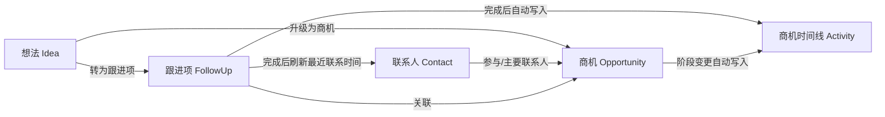
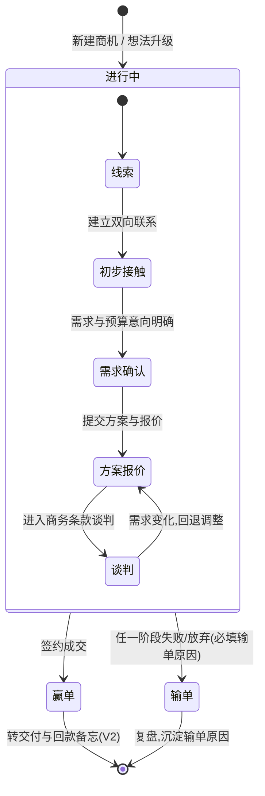
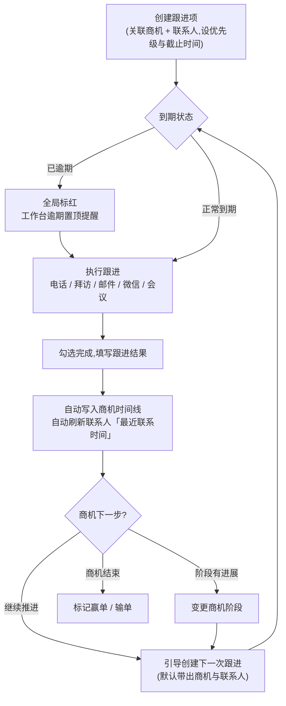
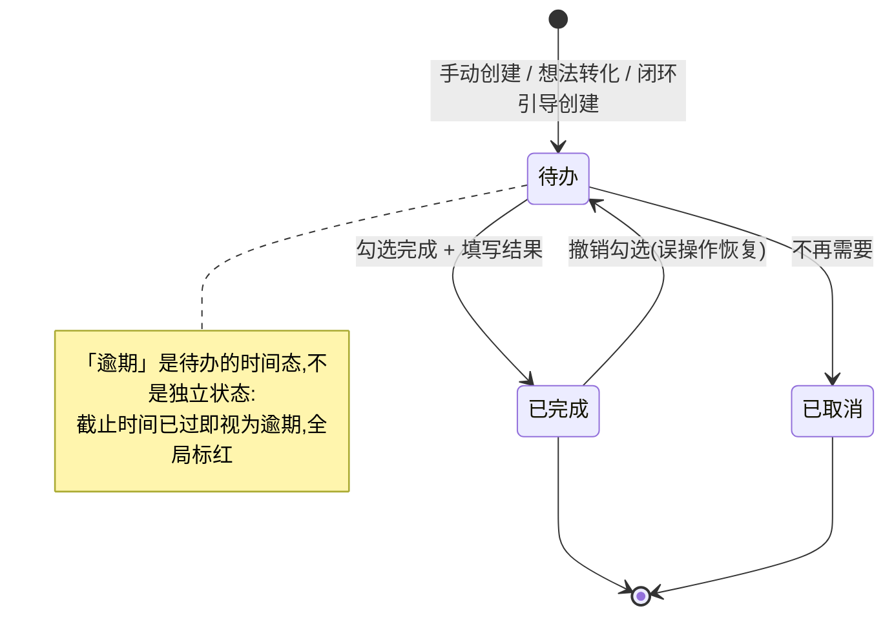
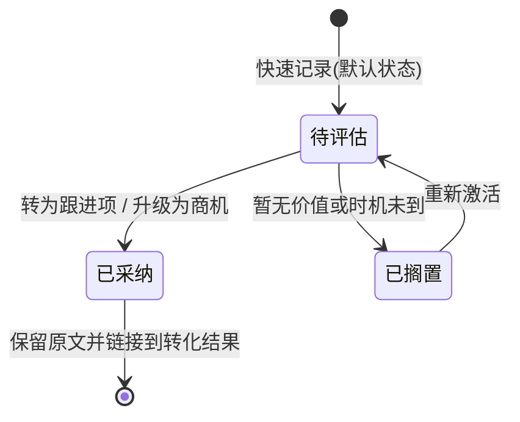
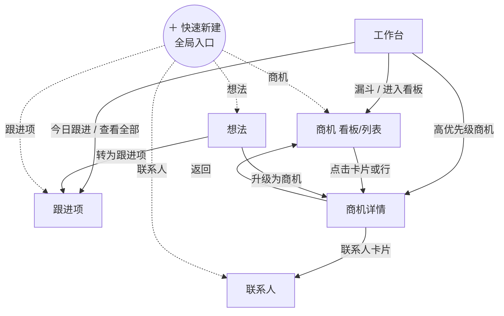

# 核心流转与流程设计

> 本文档定义「机汇」四个核心对象(商机 / 联系人 / 跟进项 / 想法)的状态流转规则与关键业务流程,是开发实现的依据。所有图使用 mermaid 绘制,GitHub 上可直接渲染。

---

## 1. 总览:对象转化关系

想法是最轻的入口,跟进是推进商机的动作,时间线是过程的自动沉淀:

---

## 2. 商机阶段流转(状态机)

**阶段定义与默认赢率:**

| 阶段 | 默认赢率 | 进入标准 | 该阶段的关键动作 |
| --- | --- | --- | --- |
| 线索 | 10% | 拿到有效客户信息 | 收集背景、约首次沟通 |
| 初步接触 | 20% | 已建立双向联系 | 摸清需求方向与决策链 |
| 需求确认 | 40% | 需求明确且有预算意向 | 调研纪要、明确范围、识别关键人 |
| 方案报价 | 60% | 已提交方案 / 报价 | 跟进反馈、处理异议、对比竞品 |
| 谈判 | 70% | 进入商务条款谈判 | 合同条款、价格与付款方式 |
| 赢单 | 100% | 合同签署 | 交接交付、回款跟踪(V2) |
| 输单 | 0% | 明确失败或放弃 | **必填输单原因**,季度复盘 |

**流转规则:**

1. 阶段允许跳跃和回退(例如线索直接到需求确认),每次变更自动写入时间线;
2. 阶段变更时赢率自动更新为该阶段默认值,允许手动修正;
3. 输单是显式操作且必填原因 —— 输单原因是最有价值的复盘数据;
4. 进入谈判及以后阶段时,建议(不强制)将优先级提升至 P1 以上。

---

## 3. 跟进闭环流程(产品核心)

> 目标:**每个进行中的商机,任何时刻都有一条"下一步"跟进。** 商机丢单最常见的原因不是输给竞品,而是"忘了跟"。

**闭环兜底机制:** 工作台持续检测「没有任何待办跟进的进行中商机」,以"无下一步"警示展示,一键补建跟进。

---

## 4. 跟进项状态流转

**时间分组规则(跟进项页 / 工作台):**

| 分组 | 规则 | 展示 |
| --- | --- | --- |
| 已逾期 | 截止时间 < 当前时间 | 红色置顶 |
| 今天 | 截止时间为今天且未过期 | 工作台「今日跟进」同源 |
| 本周 | 未来 7 天内 | 常规 |
| 以后 | 7 天以外 | 常规 |
| 今日已完成 | 今天完成的跟进 | 删除线样式,可撤销 |

组内一律按 **优先级 → 截止时间** 排序。

---

## 5. 想法流转

**转化规则:**

- **转为跟进项:** 自动带出想法标题、内容与关联商机,默认截止时间 +3 天、优先级继承想法优先级;
- **升级为商机:** 打开预填的新建商机表单(名称 = 想法标题、备注 = 想法内容),保存后想法标记为已采纳;
- 转化后原想法**不删除**,标记「已采纳」并保留到转化结果的链接,便于回溯;
- **每周回顾机制:** 想法页顶部提示待评估数量,推荐每周固定时间批量处理(评估 → 转化或搁置)。

---

## 6. 页面导航流转

---

## 7. 数据自动联动规则

系统自动维护的联动关系,用户无需手动同步:

| 触发动作 | 自动联动 |
| --- | --- |
| 完成跟进 | ① 结果写入商机时间线;② 刷新关联联系人「最近联系时间」;③ 弹出「创建下一次跟进」引导 |
| 商机阶段变更 | ① 写入时间线;② 赢率更新为该阶段默认值 |
| 标记赢单 | ① 记录成交时间;② 计入赢单率与已赢金额统计 |
| 标记输单 | ① 必填输单原因并写入时间线;② 计入赢单率分母 |
| 想法转化 | ① 生成跟进项 / 商机并建立双向链接;② 想法状态置为已采纳 |
| 跟进逾期 | ① 全局红色标识;② 工作台逾期置顶 |
| 联系人 14 天未联系 | 联系人列表红色提示「N 天未联系」 |
| 进行中商机无待办跟进 | 工作台 / 详情页「无下一步」警示 |

---

## 8. 与实现的映射

- 状态枚举与字段定义见 [`design.md · 数据模型设计`](design.md#3-数据模型设计);
- MVP 代码中,上述联动规则集中实现在全局 store 的 action 层(`src/store.ts`),保证任何入口触发的行为一致;
- 时间线(Activity)只增不改,是过程审计的事实来源。
